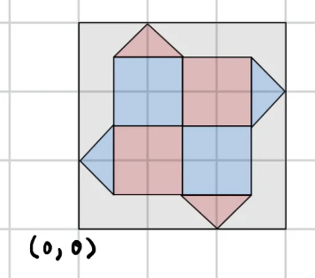
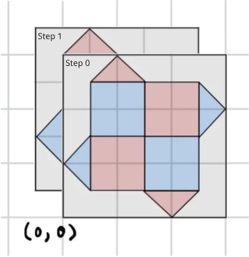
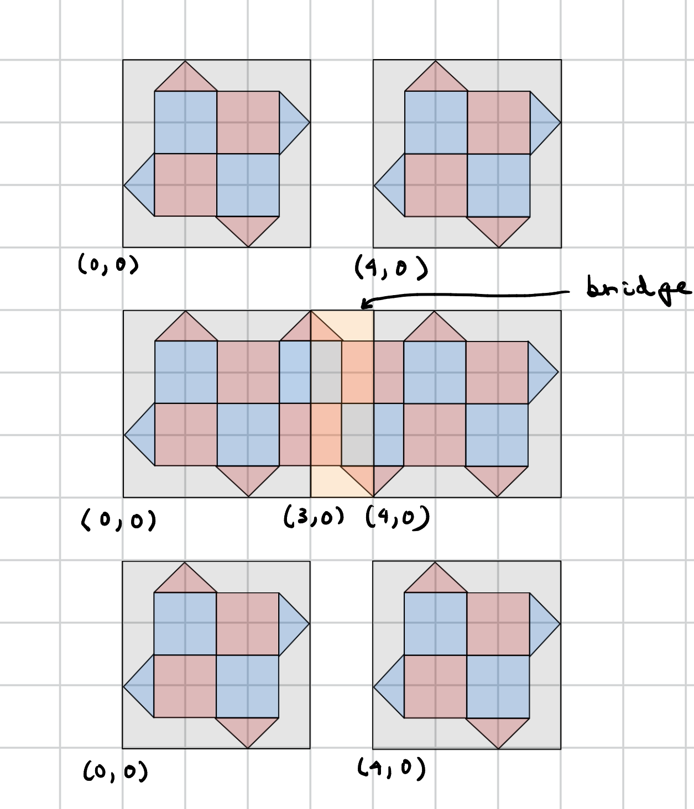
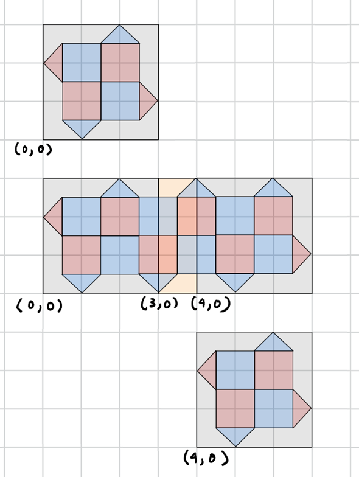

---
jupytext:
  text_representation:
    extension: .md
    format_name: myst
    format_version: 0.13
    jupytext_version: 1.19.6
kernelspec:
  display_name: deltakit (3.12.x)
  language: python
  name: python3
---

# Getting Started with Logical Assembly API

Logical assembly (LogASM) is a Python-based Domain Specific Language (DSL) for defining logical operations on logical patches in space and time. It can be used to define logical programs at the level of abstraction of lattice surgery space time diagrams (comparable to TQEC’s BlockGraphs) or transversal operations. The DSL also includes classical operations such as control flow.

LogASM is designed to make QEC accessible to the type of user who wants to experiment with high level QEC concepts without needing deep QEC knowledge. For the more experienced, it streamlines the construction of larger and more complex experiments. For those looking for the Circuit Builder API, see [`circuit_builder_api.ipynb`](../../circuit_builder_api/guides/circuit_builder_api.ipynb).

```{code-cell} ipython3
# This file contains information which is proprietary to Riverlane Ltd
# ("Riverlane") and is Riverlane Confidential Information.
# (c) Copyright Riverlane 2025-2026. All rights reserved.

from deltakit_compile.frontend.circuit import Qubit, QubitReg, Result
from deltakit_compile.frontend.logasm import LogAsmBuilder, LogAsmSubroutine, RotatedPlanarPatch
from deltakit_compile.frontend.logical_assembler import LogicalAssembler, LogicalAssemblerConfig
from deltakit_compile.passes.stim.stim_export.pipeline import StimExportPipelineConfig
```

The following is an example program written in LogASM.

```{code-cell} ipython3
d = 5
builder = LogAsmBuilder()
p0 = builder.declare_patch(RotatedPlanarPatch(d, d, location=(0, 0)))
p1 = builder.declare_patch(RotatedPlanarPatch(d, d, location=(d + 1, 0)))

# Prepare two logical patches and measure their stabilisers for d rounds
p0.prepare("Z")
p1.prepare("Z")
p0.measure_stabilisers(d)
p1.measure_stabilisers(d)

# Do a lattice surgery merge and split between the logical patches, connected by an implicit bridge
builder.multi_pauli_measure([p0, p1], pauli_bases=["Z", "Z"])

# Measure stabilisers for d rounds and measure out the patches
p0.measure_stabilisers(d)
p1.measure_stabilisers(d)
b0 = p0.measure("Z")
b1 = p1.measure("Z")

# Return the patches' corrected logical bits to the user
builder.add_return(b0)
builder.add_return(b1)
```

You write a LogASM program using the `LogAsmBuilder` and the objects it returns, which represent, in this example, patches (`p0`, `p1`) and corrected logical bits (`b0`, `b1`). You can then build a `LogAsmProgram` object by running `LogAsmBuilder.build_program()`. This converts the program into xDSL IR, which can be seen by printing the program object.

```{code-cell} ipython3
program = builder.build_program()
print(program)
```

The program can also be visualised, allowing you to check that it does what you expect it to.

```{code-cell} ipython3
# TODO: Use deltakit-visualise here
```

Finally, the program can be compiled to a physical circuit using the `LogicalAssembler`. By default, this will be in physical circuit IR, for use with packages such as `deltakit-simulate`, but exporting to other languages, such as Stim, is also available.

```{code-cell} ipython3
compiling_config = LogicalAssemblerConfig(export_config=StimExportPipelineConfig())
assembler = LogicalAssembler(compiling_config)
# TODO: Finish logical assembler full pipeline
# result = assembler.compile(program)
```

## Patches

When declaring a patch, you pick a code type which determines the patch methods available.

```{code-cell} ipython3
# QubitReg (the base type for patches) does not have any patch methods
builder = LogAsmBuilder()
qubits = builder.declare_patch(QubitReg(3))

# More specific patch types will have more specific methods available
p0 = builder.declare_patch(RotatedPlanarPatch(3, 3, vertical_z=True))
p0.prepare("Z")
p0.measure_stabilisers(5)
b0 = p0.measure("Z")
```

A patch may be indexed/sliced to get the qubits it contains as `Qubit`/`QubitReg`, which don't have any patch methods but can be used with the Circuit Builder (see [`circuit_builder_api.ipynb`](../../circuit_builder_api/guides/circuit_builder_api.ipynb)). Visualise the patch to see how the qubit indices are arranged within the patch.

```{code-cell} ipython3
# TODO: Patch visualisation here

assert isinstance(p0[2], Qubit)  # The bottom right data qubit
assert isinstance(p0[3:6], QubitReg)  # The middle row of data qubits
assert len(p0[2:5]) == 3
```

Specifying further detail about patches, such as boundary parity (bump locations) is not currently supported, as such information is determined automatically during compilation.

### Patch locations

Patches where a location and physical structure would be well defined (e.g. a `RotatedPlanarPatch` has a defined structure, a `QubitReg` does not) can be defined with a patch location and report that location back.



```{code-cell} ipython3
p0 = builder.declare_patch(RotatedPlanarPatch(3, 3, location=(5, 5)))
assert p0.location == (5, 5)

# Set the location of the patch using the relative coordinates of a specific qubit in the patch as
# the origin (the bottom middle data qubit in this case)
p1 = builder.declare_patch(RotatedPlanarPatch(3, 3, location=(6.5, 5.5), origin=(1.5, 0.5)))
assert p1.location == p0.location
```

Patches with dynamic qubit locations (e.g. an `ISWAPRotatedPlanarPatch`) maintain a fixed origin, with their internal data shifting around relative to that origin in steps. For example, an ISWAP rotated planar code has two steps for the two locations the data qubits swap between.



```{code-cell} ipython3
# TODO: Implement ISWAPRotatedPlanarPatch
# p0 = builder.declare_patch(ISWAPRotatedPlanarPatch(3, 3, location=(0, 0))
```

The logical assembler may add extra operations, such as rounds of stabiliser measurements, if dynamic patches need aligning for a multi-patch operation. A dynamic patch has a default state it is declared in (`step = 0`), but may be declared in another of its dynamic states by setting step explicitly.

```{code-cell} ipython3
# p0 = builder.declare_patch(ISWAPRotatedPlanarPatch(3, 3, location=(0, 0), step=1))
```

A QubitReg can be defined with an explicit location for each qubit. Additionally, if a qubit has a location you may also get that qubit by its global location or relative to the origin of its patch if that location can be known at program `build` time.

```{code-cell} ipython3
qubits = builder.declare_patch(QubitReg(2, qubit_locations=[(1, 1), (1, 2)]))
assert qubits[0].location == (1, 1)

p0 = builder.declare_patch(RotatedPlanarPatch(3, 3, location=(5, 5)))
assert p0.at_location(5.5, 5.5).location == p0.at_relative_location(0.5, 0.5).location
```

You may only set the location of a qubit once during declaration. Modifications to patch location during a program are done using explicit movement operations.

## Patch Operations

Different code types will offer different operations, so we will focus on rotated planar code for now. 

### Core operations

These are the most common single patch operations, all being methods on the patch object.

```{code-cell} ipython3
# Prepare the patch in a logical basis, e.g. preparing in Z being a reset into state |0>
p0.prepare(basis="Z")

# Measure stabilisers on the patch for a minimum number of rounds (minimum because the compiler may
# add more rounds to align, e.g., parallel regions)
p0.measure_stabilisers(min_rounds=5)

# Apply a gate transversally (multi-patch transversals are handled separately).
p0.transversal("X")

# Measure out the patch in a basis - this returns the corrected logical, so implies the need to wait
# for a decoder to provide a correction
corrected_logical = p0.measure(basis="Z")
```

### Multi-patch operations

A merge and split operation between logical patches can be done as one `multi_pauli_measure` logical operation. This automatically creates the bridge required between the two patches.

```{code-cell} ipython3
d = 3
p0 = builder.declare_patch(RotatedPlanarPatch(d, d, location=(0, 0)))
p1 = builder.declare_patch(RotatedPlanarPatch(d, d, location=(d + 1, 0)))

p0.prepare("Z")
p1.prepare("Z")

xx_logical = builder.multi_pauli_measure(operand_patches=[p0, p1], pauli_bases=["X", "X"])
```



The automatic bridge construction will handle scenarios that are completely unambiguous, i.e., straight line bridges with no obstacles in the way. Bridges can also be defined explicitly, allowing for more complex bridge shapes (e.g. an S-shaped bridge formed from multiple bridge patches). By default, the multi-pauli will be done in the minimum valid number of rounds, but you may also explicitly specify a number of rounds if required. The following is the same example above defined more explicitly.

```{code-cell} ipython3
d = 3
p0 = builder.declare_patch(RotatedPlanarPatch(d, d, location=(0, 0)))
p1 = builder.declare_patch(RotatedPlanarPatch(d, d, location=(d + 1, 0)))

p0.prepare("Z")
p1.prepare("Z")

bridge = builder.declare_patch(RotatedPlanarPatch(1, d, location=(d, 0)))
xx_logical = builder.multi_pauli_measure(
    operand_patches=[p0, p1], bridges=[bridge], rounds=d, pauli_bases=["X", "X"]
)
```

Similarly, a multi-pauli with more than two logical patches may be defined by adding more logical patches, pauli bases, and making sure the bridge patches connect all of them.

```{code-cell} ipython3
p0 = builder.declare_patch(RotatedPlanarPatch(d, d, location=(0, 0)))
p1 = builder.declare_patch(RotatedPlanarPatch(d, d, location=(d + 1, 0)))
p2 = builder.declare_patch(RotatedPlanarPatch(d, d, location=(2 * d + 2, 0)))

p0.prepare("Z")
p1.prepare("Z")
p2.prepare("Z")

bridge0 = builder.declare_patch(RotatedPlanarPatch(1, d, location=(d, 0)))
bridge1 = builder.declare_patch(RotatedPlanarPatch(1, d, location=(2 * d + 1, 0)))
xxx_logical = builder.multi_pauli_measure(
    operand_patches=[p0, p1, p2], bridges=[bridge0, bridge1], pauli_bases=["X", "X", "X"]
)
```

Multi-patch operations in systems that don’t require lattice surgery can be done using multi-patch transversal operations.

```{code-cell} ipython3
builder.transversal("CX", [p0, p1])
```

### Size and location manipulation operations

A patch can be grown or shrunk by essentially pulling its sides outwards or inwards. It may also be moved, using the same bridging process as with a `multi_pauli_measure`.

```{code-cell} ipython3
p0.grow(top=1, right=1)  # Grows the patch by distance 1
p0.shrink(bottom=1)  # Push the bottom of the patch up by 1 to make it rectangular

# Move the patch horizontally by 4 using a compiler synthesised straight bridge
p0.move(offset=(4, 0))

# The same move, but with an explicitly declared bridge and number of rounds, shown on an
# independent patch in the pre-move layout (bridge locations must match the moving patch's
# current bounding box, not a stale one)
p0_explicit = builder.declare_patch(RotatedPlanarPatch(4, 3, location=(20, 1)))
bridge = builder.declare_patch(RotatedPlanarPatch(1, 3, location=(24, 1)))
p0_explicit.move(offset=(4, 0), bridges=[bridge], rounds=3)
```



While the same patch movement could be achieved using a grow and shrink, the dedicated move is clearer and can do more complex moves (e.g a move through an S-shaped bridge), so is therefore the advised way to move patches. It is also possible, however, to create a move that can’t be expressed in bridges (e.g. a move by (1, 1), leaving the patch inside its previous footprint). Small movements like this can be instead achieved using the step operation. In addition to allowing for smaller movements, step guarantees that the patch stays the same (normal patch movement will flip the patch's stabilisers if done with an odd offset).

```{code-cell} ipython3
p0.step(offset=(1, 0))
```

Patches may be rotated such that their Z and X logicals swap between being vertical or horizontal. The way this is done necessitates the patch moving its own code distance in a user-selected direction.

```{code-cell} ipython3
p0.rotate(offset=(0, 3))  # Rotate this d3 90 degrees, moving it upwards
```

All resizing and movement patch operations that involve rounds of stabiliser measurements will occur in the minimum required number of rounds unless an optional argument is provided specifying a static number (same as `multi_pauli_measure`).

## Parallelism

The logical assembler will automatically parallelise LogASM operations where possible. This can also be prevented by the introduction of barriers between operations.

```{code-cell} ipython3
d = 3
p0 = builder.declare_patch(RotatedPlanarPatch(d, d))
p1 = builder.declare_patch(RotatedPlanarPatch(d, d))

# These are isolated from each other, so will be put in parallel
p0.prepare("X")
p1.prepare("X")

p0.measure_stabilisers(5)
builder.barrier(p0, p1)  # prevent ops using p0 or p1 from crossing this barrier
p1.measure_stabilisers(5)
```

Where operations of different lengths can be put in parallel the compiler may add extra rounds of memory to keep the patches on the shorter side from decohering. Note that in the following example the compiler only needs to add rounds to `p0` because the two patches must be aligned both before and after the parallel region for the two transversal ops. If the first transversal op had not existed then extra rounds of memory would not be required - the compiler could, for example, align `p0`'s 5 rounds with the last 5 rounds on `p1` instead.

```{code-cell} ipython3
builder.transversal("CX", [p0, p1])

# These are put in parallel
p0.measure_stabilisers(min_rounds=5)  # This will be lengthened to 10
p1.measure_stabilisers(min_rounds=10)

builder.transversal("CX", [p0, p1])
```

## Control Flow

LogASM supports if, else, and while with basic integer comparison, and for loops with standard Python arguments.

```{code-cell} ipython3
# TODO: support context managers.
b0 = p0.measure("Z")
# with builder.if_(b0 == 1):
#     p1.transversal("H")
# with builder.else_():
#     p1.transversal("X")

b0 = p0.measure("X")
# with builder.while_(b0 != 0):
#     b0 = p0.measure("X")

# with builder.for_(0, 10, 2):  # start, exclusive stop, step
#     log0 = p0.measure("X")
```

A LogASM for loop is more general than a Stim REPEAT as we are leaving open the door to using runtime classical variables in the for loop arguments rather than Stim’s fixed-at-compile-time number of repetitions.

The expression that forms the condition for an if or while must involve an object that came from LogAsmBuilder methods (e.g. a corrected logical) - an expression that would be resolved at Python runtime (e.g. isinstance(var, int) is invalid and the builder will throw an error). Similarly, normal Python statements that don’t involve the builder or an object that came from the builder will be executed at Python runtime and will not be included in the control flow:

```{code-cell} ipython3
# This control flow will be entirely optimised away as both if and else will
# be empty from the compiler's point of view

# TODO: support context managers.
# with builder.if_(log0 == 0):
#     var = 0
# with builder.else_():
#     var = 10

# print(var)  # Always prints 10
```

## Subroutines

As programs get bigger, you may want to break reusable chunks off into their own subroutines. Subroutines can be defined in the same way a program is defined, but the patches are arguments provided when the subroutine is called. They are produced using `LogAsmBuilder.build_subroutine("subroutine_name")` to get a `LogAsmSubroutine` object that can be called with another builder.

```{code-cell} ipython3
# Build a subroutine (it is recommended to do this in a function to keep things compartmentalised
# and make type hinting clear)
def build_my_subroutine() -> LogAsmSubroutine[[RotatedPlanarPatch], None]:
    builder = LogAsmBuilder()
    p0 = builder.add_arg(RotatedPlanarPatch(3, 3))
    p0.measure_stabilisers(5)
    return builder.build_subroutine("my_subroutine")


# Build a program that calls the subroutine
builder = LogAsmBuilder()
my_subroutine = build_my_subroutine()

p0 = builder.declare_patch(RotatedPlanarPatch(3, 3))
builder.call_subroutine(my_subroutine(p0))

print(builder.build_program())
```

Patches may only be defined in the main program, but any object type a builder can return, apart from the built program object itself, may be used as arguments. Returns of a subroutine have the additional restriction of not being able to include qubits. Returns added to the main program are treated as outputs of the program as a whole.

```{code-cell} ipython3
def build_cond_meas() -> LogAsmSubroutine[[RotatedPlanarPatch, Result], Result]:
    builder = LogAsmBuilder()
    p0 = builder.add_arg(RotatedPlanarPatch(5, 5))
    _log = builder.add_arg(Result)
    # TODO: support context managers.
    # with builder.if_(log == 1):
    #     log2 = p0.measure("Z")
    # with builder.else_():
    #     log2 = log
    log2 = p0.measure("Z")

    builder.add_return(log2)
    return builder.build_subroutine("cond_meas")


builder = LogAsmBuilder()
cond_meas = build_cond_meas()

p0 = builder.declare_patch(RotatedPlanarPatch(5, 5))
log = p0.measure("Z")
returned_log2 = builder.call_subroutine(cond_meas(p0, log))
builder.add_return(returned_log2)  # Output to the user

print(builder.build_program())
```

The arguments and returns of a subroutine may also be constrained to more specific types, which the logical assembler can check for.

```{code-cell} ipython3
# Will accept any patch
p0 = builder.add_arg(QubitReg())

# Will only accept a 3x3 rotated planar patch
p1 = builder.add_arg(RotatedPlanarPatch(3, 3))
```

Combining these features, you can define libraries of reusable subroutines, including parametrisation and type hints for the built objects.

```{code-cell} ipython3
def build_z_memory(distance: int) -> LogAsmSubroutine[[RotatedPlanarPatch], None]:
    """Build a subroutine that executes qmem on a rotated planar patch of the
    provided distance."""
    builder = LogAsmBuilder()
    p0 = builder.add_arg(RotatedPlanarPatch(distance, distance))
    p0.prepare("Z")
    p0.measure_stabilisers(distance)
    p0.measure("Z")
    return builder.build_subroutine("z_memory")


print(build_z_memory(7))
```
